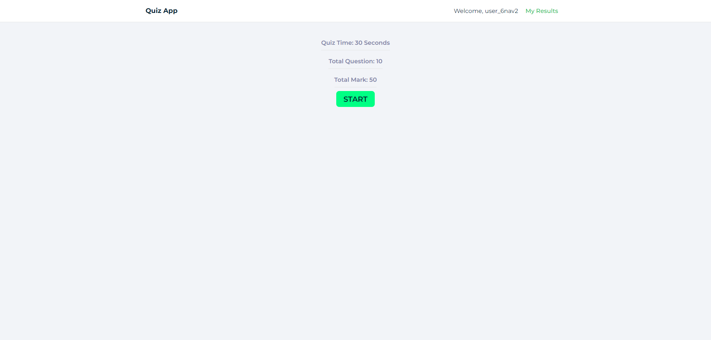
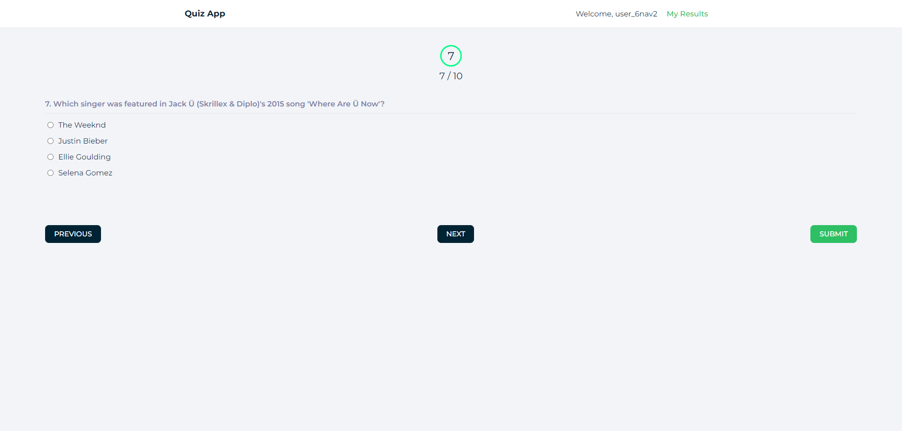
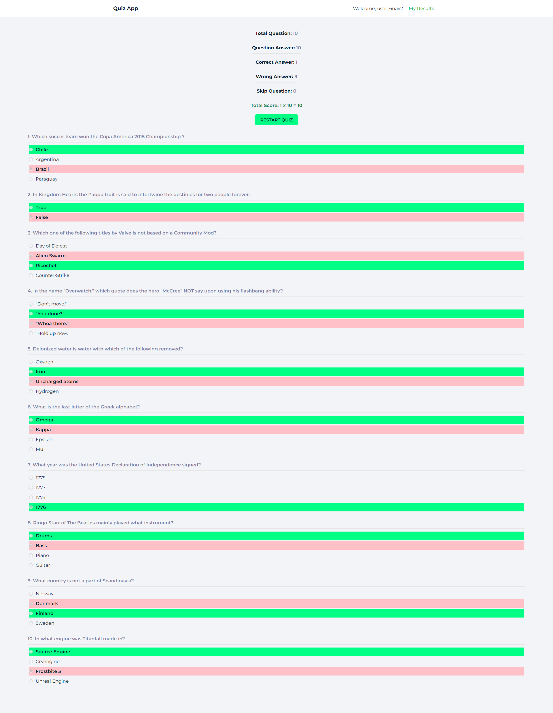
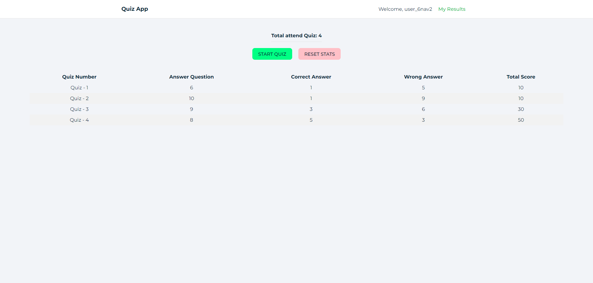

# Quiz App

This is a quiz app where randomly generated usernames allow users to take quizzes, answer or skip questions, and submit at any time. The app shows users their results after quiz submission, providing a seamless quiz-taking experience.

## Features

-   Random username generation for each quiz session.
-   Users can answer or skip questions and submit the quiz at any point.
-   Displays results at the end of the quiz, showing correct and skipped answers.
-   Integrated with the [Open Trivia Database API](https://opentdb.com) for fetching quiz questions.
-   Fully responsive design for optimal user experience across devices.

## Technologies Used

-   ReactJS
-   Redux
-   Axios

## Installation

1. Clone the repository:

    ```bash
    git clone https://github.com/yourusername/quiz-app.git
    ```

2. Navigate to the project directory:

```bash
   cd next-shopping-cart-app
```

3. Install dependencies:

```bash
   npm install
```

4. Run the development server:

```bash
   npm start
```

5. Open your browser at http://localhost:3000 to view the app.

## Screenshot

#### Start Quiz Page



#### Quiz Page



#### Answer Page



#### Results Page



### API Integration

This app uses the [Open Trivia Database API](https://opentdb.com/) to generate random questions for the quiz sessions. The API supports a variety of categories and difficulty levels, although this implementation focuses on general trivia.

### How to Use

-   Start the quiz by clicking the "Start Quiz" button.
-   Answer each question or skip as needed.
-   Submit the quiz at any time to view your score and review the answers.

## Contributing

Pull requests are welcome. For major changes, please open an issue to discuss what you would like to change.
